:::{.callout-tip icon="false" collapse="false"}
###  Learning Objectives

By the end of this module, you will be able to:

- <u>Define</u> "branch" in the context of Git/GitHub 
- <u>Summarize</u> the main steps of a workflow that uses branches
- <u>Create</u> a branch on an existing repository

:::

## What is a Branch?

A **"branch"** is essentially a working environment in your Git repository that is separate from your main working area. This can be incredibly useful when you have a task to work on but you don't want to risk damaging the version of your code that already works. Note that "branch" can be either a noun or a verb as with many of the Git vocabulary words discussed earlier (e.g., "commit", "push", etc.).

Branches are typically created with **the intent to put the work in the branch back into the main branch when you are done with it.** Implicit in that rationale is the fact that most branches are created with a specific task/sub-task in mind and known to be temporary from the outset.

As an example, imagine that you want to put a better engine in your car but you don't want to risk damaging your car as you go about that job. In Git terms you could create a branch to work on those mechanical improvements while at the same time preserving your original car separately (in the "main" branch). When you're done experimenting and happy with the new version of your car, you can merge the two cars keeping all of the improvements you made in your branch.

Even if you think you've never worked with Git branches you actually have! All Git repositories actually start in a branch named "main" so even if you've never intentionally created a branch, you've been working in your "main" branch all along.

## Branch Workflow Overview

Before diving into the specifics of how to use branches while working with Git, let's take a look at a general overview of that process.

As with many other Git operations, the first thing to do is **<span style="color:blue">pull</span>** from GitHub to your local repository to ensure that you're working with the most up-to-date version of everything in the repo (see **Step 1** below).

Once that is done, you can create a branch on your local machine. This will automatically shift your IDE into that new branch. Doing this on your machine also updates GitHub to show that there are multiple branches (see **Step 2** below).

Once you have created a branch you can work in it locally (and via GitHub directly) as you would normally. You can **<span style="color:gold">edit</span>** your files locally, **commit** those changes, **<span style="color:blue">pull</span>** from GitHub (within the branch), and **<span style="color:green">push</span>** to GitHub (see **Steps 3-4** below).

When you are done working with the branch (i.e., you've finished the task for which you created the branch), you can use GitHub to merge your branch with the main one (see **Step 5** below). This puts all of the content in your branch into the main one now (which puts your local version of the "main" branch behind!).

Once the two branches are merged on GitHub, go back to your local computer, manually change the branch to the main branch and pull (see **Step 7** below). This updates your local version of the main branch and avoids future problems.

Given that most branches are not used again after they are merged, it is often a good housekeeping step to then **delete** your branch on GitHub and locally once you have successfully merged the pull request (see **Steps 6 & 8** below). Note that in the below diagram step 6 and 8 occur on either side of step 7 but in truth they can both come after depending on your preference.

However, deletion of the branch either locally or via GitHub **must** come *after* step 5!

As you can see from the above text and the below diagram, branches have a few more moving parts than the Git and GitHub operations we've discussed so far. That said, they can be a powerful tool in service of collaborative work because you can have multiple branches active at the same all working on separate tasks. This approach can be an easy (or at least eas*ier*) workflow for working together while avoiding conflicts.

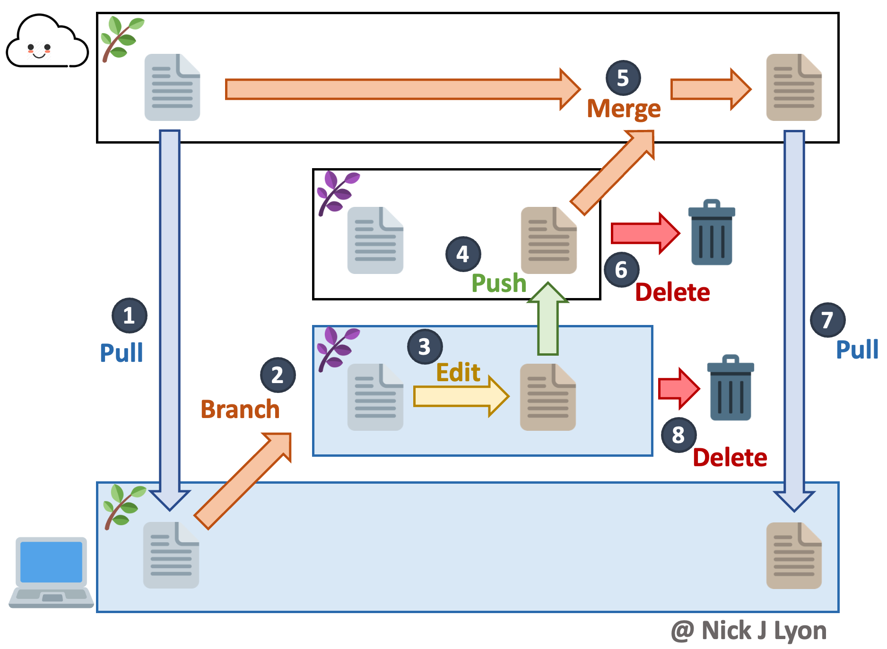{fig-alt="Graphic demonstrating the process of using branches on a Git/GitHub repository. Essentially you pull the latest changes before making a branch, then make the branch and work in it. Once you're happy with your progress, you can submit a pull request to merge your work back into the 'main' branch and then you delete your branch" fig-align="center" width="75%"}

Now we've gone over this big picture overview, let's walk step-by-step through creating, working in and ultimately merging branches!

## Create a Branch

**_Before_ you create a branch, <span style="color:blue">pull</span> from/sync with GitHub** as a precaution so that you are certain your local repository has the most up-to-date content. Failing to do so is a recipe for a brutal merge conflict when you are finished with your branch and want to merge it back into the main flow of your repository.

:::{.panel-tabset}

### In RStudio

To create a branch, click the **<span style="color:purple">purple</span>** button in the "Git" tab of RStudio that shows two rectangles connected by a diamond at right-angles from one another.

{fig-alt="Screen capture of RStudio"}

In the resulting dialogue box, **give your new branch an informative name.** In this example we haven't given our new branch a great name but in a "real" repository you will greatly appreciate having concise but descriptive branch names. Once you're happy with the name, **click the "Create" button** (you can ignore the other options and buttons on this dialogue box).

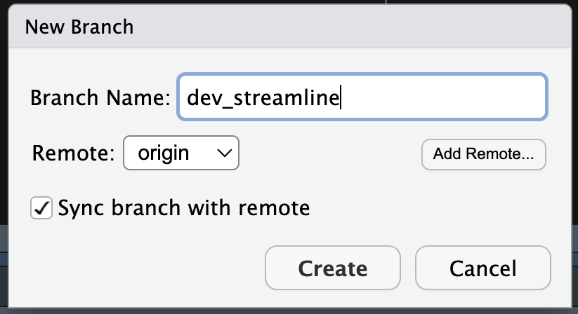{fig-alt="Screenshot of the menu that opens when you click the purple 'create branch' button in RStudio. Includes a text field for the branch name as well as a some other checkboxes/options (that can be safely left at their default settings in many cases)" fig-align="center" width="50%"}

This will create a confirmation message that is superficially similar to the format of messages returned by other Git actions.

{fig-alt="Screenshot of the text returned when you create a branch in RStudio" fig-align="center" width="80%"}

You may also notice that in your Git tab where previously it said "main" it now shows whatever name you chose for your branch.

### In Positron

To begin, **go to the "source control" section of Positron.**

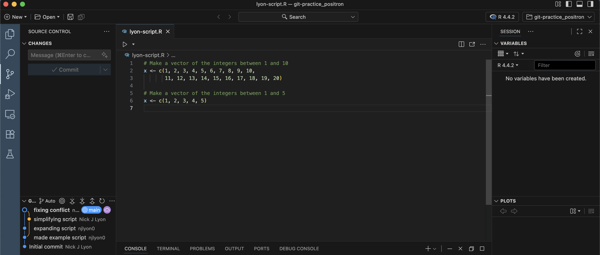{fig-alt="Screen capture of Positron"}

To create a branch, **hover over the "Changes" dropdown menu and click `...`** to expand the set of Git operations that are visible. From there, **scroll down to "Branch" and click it.** Finally, **click "Create Branch...".**

{fig-alt="Screenshot of the dropdown menu in Positron for creating a new branch" fig-align="center" width="80%"}

In the resulting field (top middle of Positron), **give your new branch an informative name.** In this example we haven't given our new branch a great name but in a "real" repository you will greatly appreciate having concise but descriptive branch names. Once you're happy with the name, **hit the Enter key on your computer.**

{fig-alt="Screenshot of the field in Positron where you type new branch names"}

Now that you've made your new branch locally, you need to send it up to GitHub. Positron calls this "Publishing" but this isn't conceptually different from any other sync/push--essentially you're just letting GitHub know that you have a branch locally that it doesn't have a record of yet. To publish the branch, **click the "Publish Branch" button.**

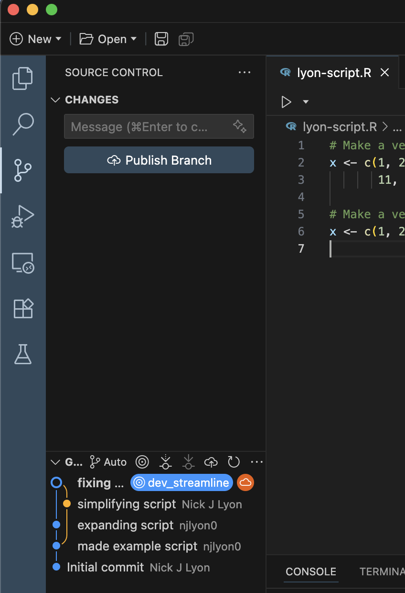{fig-alt="Screenshot of the Positron 'source control' pane where the 'Publish Branch' button is active" fig-align="center" width="80%"}

You'll know that this worked when you look at the branch diagram in the bottom left corner of Positron's source control menu. Note how the second commit from the top has the "origin/main" label while the top-most one has the label that matches whatever you named your new branch.

{fig-alt="Screenshot of the Positron 'source control' pane after a new branch has been published" fig-align="center" width="80%"}

:::

## Work in the Branch

You can now work in a branch *in the same way* that you work with GitHub via your IDE of choice when you are not using branches.

1. Make **<span style="color:gold">edits</span>**
2. **Commit** changes locally
3. **<span style="color:blue">Pull</span>** from GitHub to reduce the chances of a conflict
4. **<span style="color:green">Push</span>** your committed changes to GitHub

The reason you use the same workflow is--as previously stated--even if you don't typically use branches, all work in Git is functionally done in the "main" branch of your repository so your work in this new branch should use the same order of operations as work done in the "main" branch.

## Merging Branches

When you are done with your work in the branch, you will want to merge your new branch with the "main" branch of the repository. This branch merging is most easily done via GitHub so the following instructions are agnostic to IDE and purposefully exclude the repository name from the screen capture area. To start, **<span style="color:green">push</span>/sync your final commit(s) from your local branch with GitHub.**

### Open & Merge a Pull Request

After you <span style="color:green">push</span>/sync your changes, GitHub should recognize this and automatically create a button at the top of your repository's home page for you to start the process of creating a "pull request." Pull requests are how you merge branches on GitHub and the entire process is conducted entirely in the browser so we'll leave our IDEs until the pull request is completed.

To start the branch merging process, **click the "Compare & pull request" button**

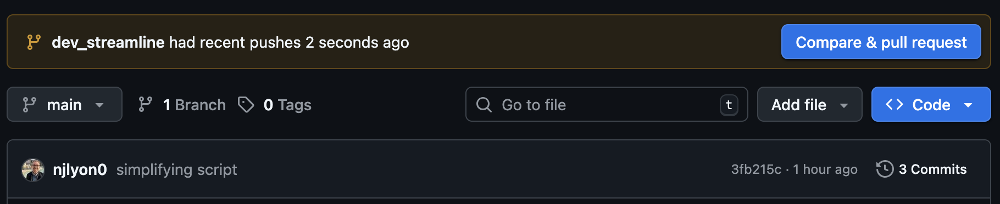{fig-alt="Screenshot of a repository in GitHub where the 'compare and pull request' button is being offered because GitHub detected a push in the branch" fig-align="center" width="80%"}

You will then be prompted to write a title and message for your pull request to give some broader context for what the branch does. This is especially valuable if you are not the one reviewing pull requests as this can help someone quickly familiarize themselves with what you have done.

Once you're satisfied with your title and message, **click the "Create pull request" button.**

{fig-alt="Screenshot of GitHub when you open a pull request and are prompted to give it a title and description"}

That done, GitHub will send you to a page that looks very much like a GitHub issue (see the module on issues for more detail). At the top is whatever title and message you just wrote when opening the pull request following by a list of all of the commits in that branch.

Those commits are hyperlinks in case you want to view the specific differences to files edited in this branch.

Note also that if you realize you forgot to do something in your branch (or if someone asks you change something) you can return to your IDE and commit/pull/push and it will automatically update on the pull request. Pull requests are for merging a whole branch, not for merging just a part of the work in the branch.

You or your team can also post messages on a pull request as needed (see the text box at the bottom of the below picture).

If you are ready to merge a pull request from your branch into the "main" branch **click the "Merge pull request" button.**

{fig-alt="Screenshot of an open pull request on GitHub"}

GitHub will open another text box where you can add a commit message to your acceptance of the pull request. If whoever opened the pull request was sufficiently detailed in their opening comment(s) this may not need to be terribly detailed but it can't hurt!

Once your message is written, **click the "Confirm merge" button.**

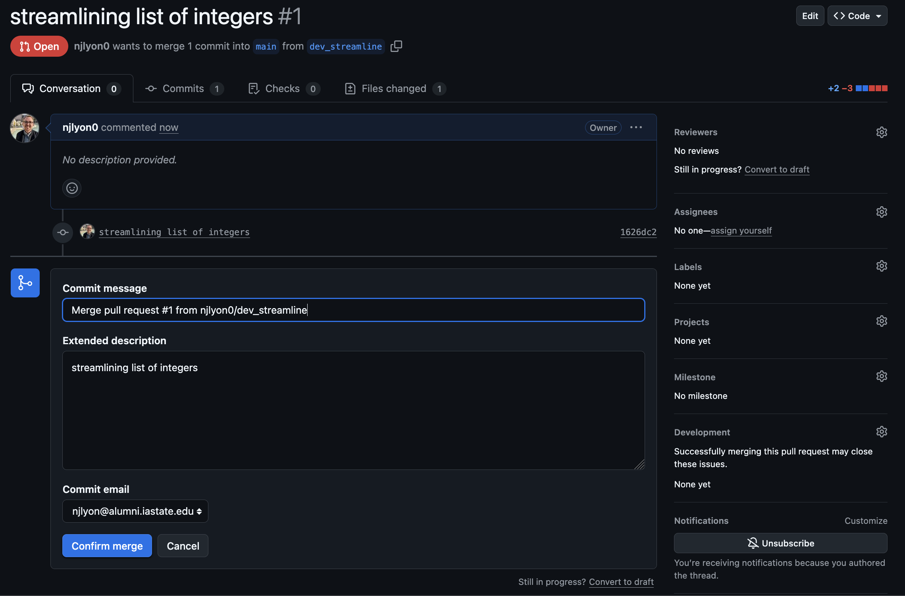{fig-alt="Screenshot of the menu that opens on GitHub when you click 'merge pull request' where you are prompted to add an optional description before clicking 'confirm merge'"}

Your pull request has now been merged! Now we need to do some minor housekeeping in GitHub that--fortunately--GitHub makes really accessible.

### GitHub Post-Merge Housekeeping

Branches are meant to be short-lived and deleted once the specific purpose for which they were created has been accomplished. So, once the pull request is merged, we should **click the "Delete branch" button.** This will ensure that the number of active branches remains manageable and also will let you re-use branch names later on if you deem that necessary.

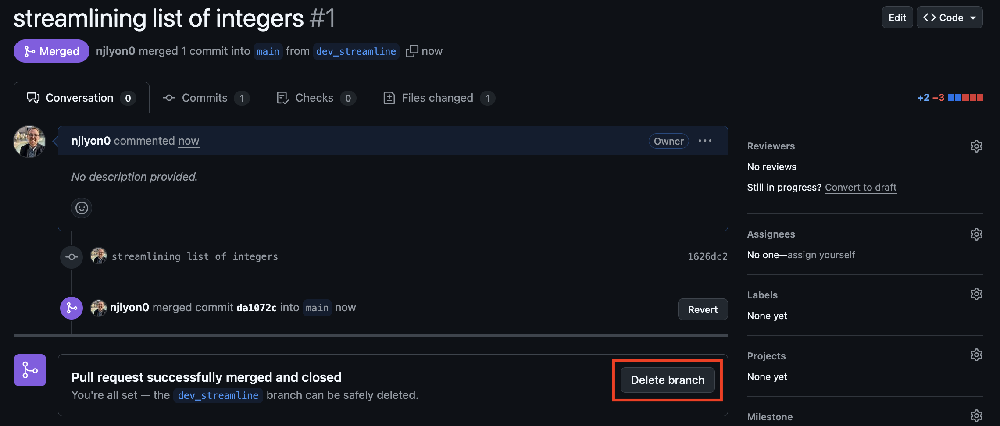{fig-alt="Screenshot of a closed pull request on GitHub with a 'delete branch' button provided"}

After you click "Delete branch" it will be replaced by a "Restore branch" button so you could always reclaim it if the deletion was premature.

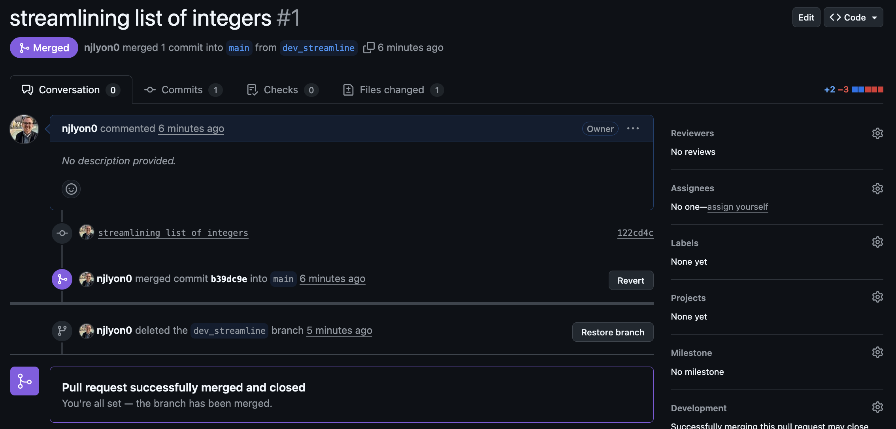{fig-alt="Screenshot of a pull request on GitHub after the 'delete branch' button has been clicked and replaced by a 'restore branch' button"}

Finally, if we return to the home page of the repository, we can see that the most recent commit is whatever we put in the pull request text field right before we merged it.

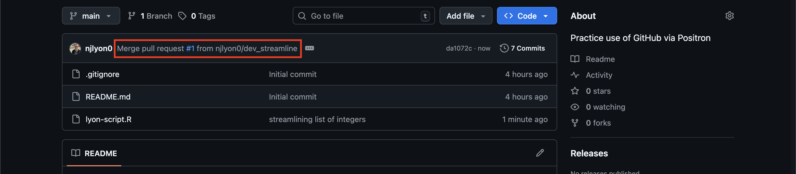{fig-alt="Screenshot of a the home page of a GitHub repository where the most recent commit matches the pull request commit message from an earlier screen capture"}

### Update the Local Clone

Now that the branches have been merged on GitHub, we need to make sure our local clone gets those updates from GitHub. This is particularly important if our IDE is still in the branch we created earlier because--now that we've deleted the branch's counterpart in GitHub--we'll get an error if we attempt to push from that branch.

::::{.panel-tabset}
### In RStudio

#### Get Updates

First, in the top right corner of RStudio, **click the active branch name and switch to back to the "main" branch.** Note that you may want to close your open files before doing this, particularly if some files were created in the branch because they wouldn't yet exist in the "main" branch locally (you merged on GitHub with the pull request but haven't pulled those updates locally).

{fig-alt="Screenshot of the Git branch dropdown menu in RStudio" fig-align="center" width="50%"}

This should create a message that looks like the following image. You should **ignore the part of the message telling you that your are up to date**; you are not up to date with GitHub yet. The message is referring to the status of your local clone's version of the "main" branch.

{fig-alt="Screenshot of the Git message in RStudio when switching branches" fig-align="center" width="80%"}

Now that you're back in the "main" branch, **pull the latest changes from GitHub.** You should receive all of the commits that you just merged via pull request earlier. This will create a message that is something like the following image--though of course it will list all changed files so it may be a longer message than what is pictured below if you edited more files.

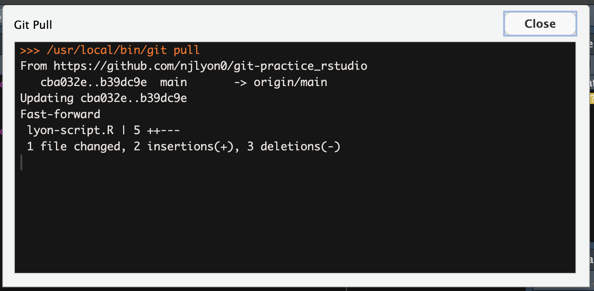{fig-alt="Screenshot of the Git message in RStudio when switching branches" fig-align="center" width="80%"}

#### Branch Housekeeping

Now that our "main" branch is updated, we need to do the same sort of branch housekeeping that we did in GitHub after merging the pull request. In RStudio's  "Terminal" pane, **delete the finished branch with the following command line code.** _Remember to replace "BRANCH_NAME" with whatever you named your branch!_

```
git branch -d BRANCH_NAME
```

Once you've deleted that branch, you'll need to "prune" your branches. The previous code deleted the local version of your branch but your IDE still 'thinks' that GitHub has an equivalent of the branch. To reduce the potential for confusion, **prune your local clone with the following command line code.** Just like branch deletion, this should code should be run in RStudio's  "Terminal" pane.

```
git remote update origin --prune
```

You can confirm that these two lines of code worked as expected by clicking the "main" branch name in RStudio's Git pane. The resulting dropdown of local and remote branches should only list the "main" branch under each sub-heading.

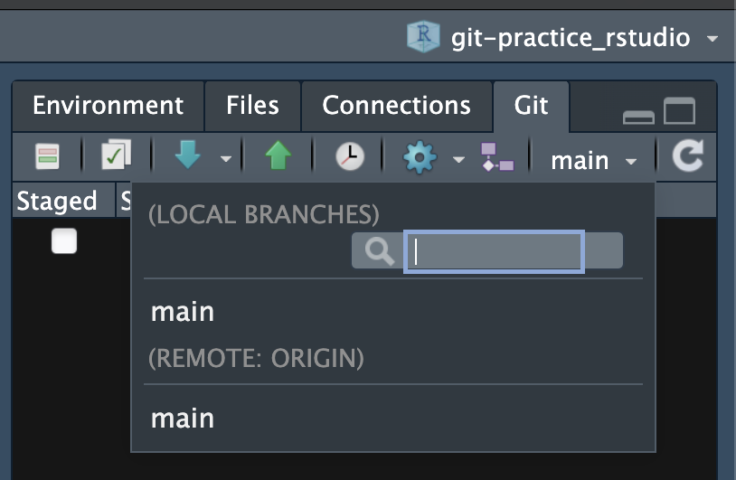{fig-alt="Screenshot of the Git branch dropdown menu in RStudio" fig-align="center" width="50%"}

### In Positron

First, in the "source control" part of Positron, **hover over the "Changes" menu and click `...`** to expand the set of Git operations that are visible. In the resulting dropdown, **scroll down and click "Checkout to...".** Note that you may want to close your open files before doing this, particularly if some files were created in the branch because they wouldn't yet exist in the "main" branch locally (you merged on GitHub with the pull request but haven't pulled those updates locally).

{fig-alt="Screenshot of the Git operations dropdown menu in Positron with the 'checkout to...' menu highlighted" fig-align="center" width="50%"}

This should open up a list of the available branches in the top middle of Positron. **Find the "main" branch in the list of available branches and click it.**

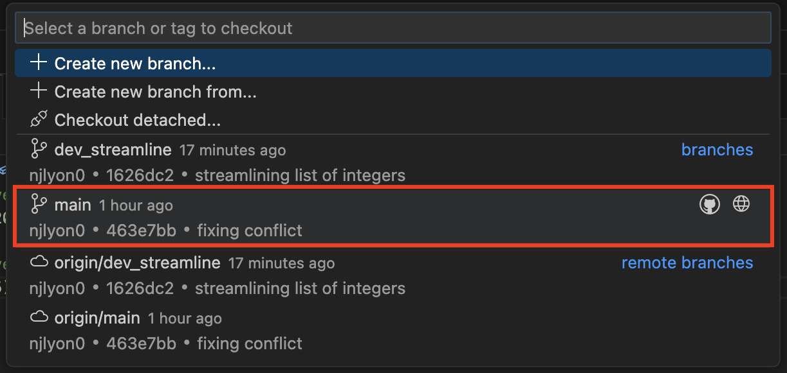{fig-alt="Screenshot of the Git operations dropdown menu in Positron" fig-align="center" width="80%"}

Now that you're back in the "main" branch, **pull the latest changes from GitHub.** You should receive all of the commits that you just merged via pull request earlier.

{fig-alt="Screenshot of the Git operations dropdown menu in Positron with the 'pull' menu highlighted" fig-align="center" width="50%"}

You will know this was successful when you **look at the branch diagram at the bottom of the "source control" menu** and see that the line for your experimental branch now re-connects to the leftmost branch's line.

{fig-alt="Screenshot of the branch diagram in Positron's source control menu" fig-align="center" width="50%"}

#### Branch Housekeeping

Now that our "main" branch is updated, we need to do the same sort of branch housekeeping that we did in GitHub after merging the pull request. In Positron's  "Terminal" pane, **delete the finished branch with the following command line code.** _Remember to replace "BRANCH_NAME" with whatever you named your branch!_

```
git branch -d BRANCH_NAME
```

Once you've deleted that branch, you'll need to "prune" your branches. The previous code deleted the local version of your branch but your IDE still 'thinks' that GitHub has an equivalent of the branch. To reduce the potential for confusion, **prune your local clone with the following command line code.** Just like branch deletion, this should code should be run in Positron's  "Terminal" pane.

```
git remote update origin --prune
```

You can confirm that these two lines of code worked as expected by clicking the "Checkout to..." button in the dropdown menu of Git operations. The resulting list of branches should only list the "main" branch under each sub-heading.

{fig-alt="Screenshot of the Git branch dropdown menu in Positron" fig-align="center" width="80%"}

::::
