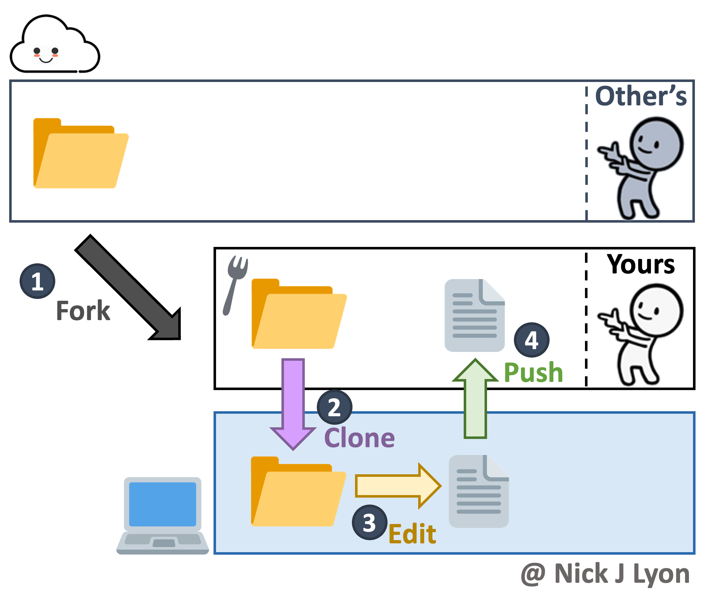
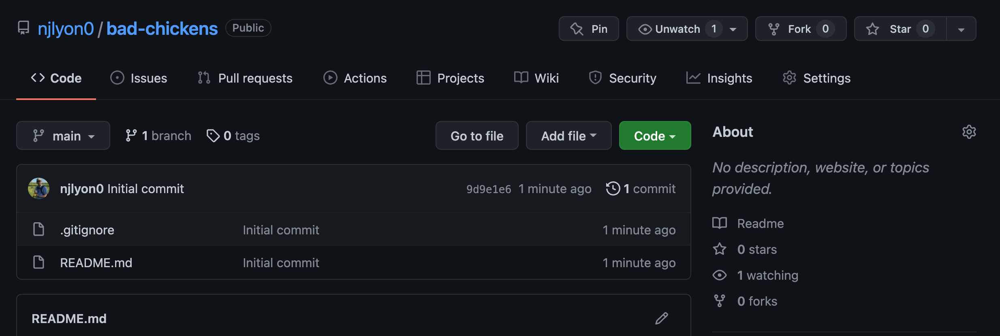
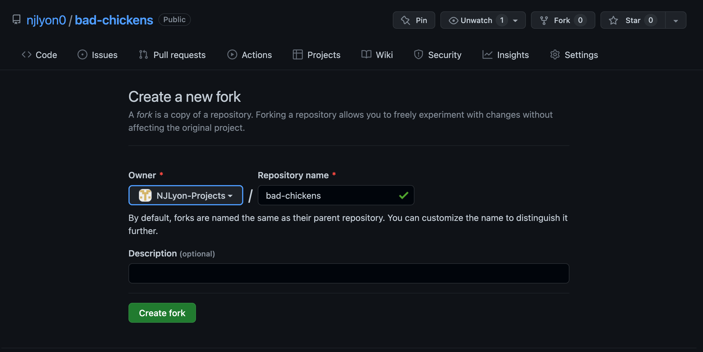
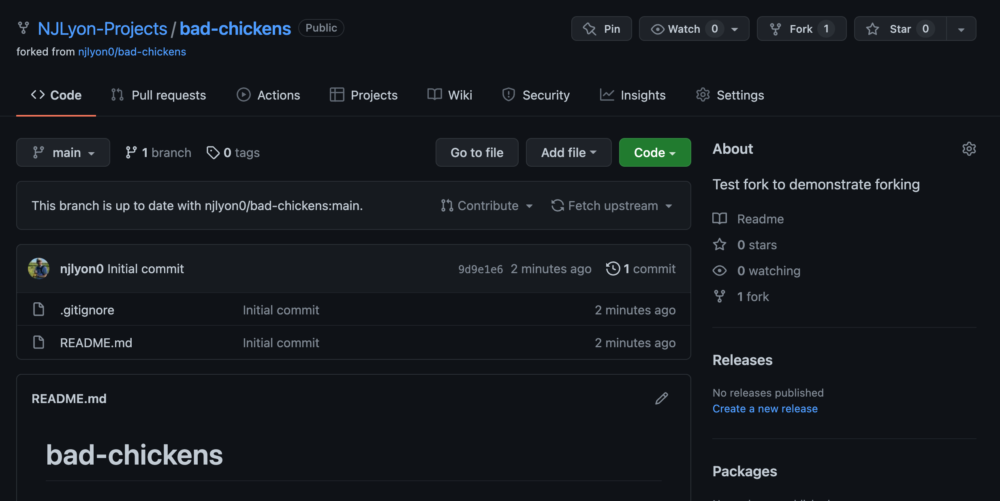

:::{.callout-tip icon="false" collapse="false"}
###  Learning Objectives

By the end of this module, you will be able to:

- <u>Define</u> "fork" in the context of Git/GitHub
- <u>Contrast</u> forks with branches
- <u>Use</u> the fork feature on GitHub for an existing repository

:::

## What is a Fork?

A **fork** is a duplicate of a GitHub repository that has a different owner than the original. Any repository that you can view on GitHub, you can fork. This includes (1) any public repository, and (2) private repositories to which you have access.

Forks are most commonly used when you want to use someone else's work to 'jump start' your own, but aren't collaborating with that person / likely don't want to re-integrate your changes into their version of the project. For example, if you attend a workshop that has a GitHub repository full of examples, you might fork that repository and change the examples for your subject area so that you can use it in your own version of the workshop.

### Forks versus Branches

The difference between **forks** and **branches** is a source of great confusion for many (even veteran!) Git and GitHub users but hopefully this list helps to clarify!

| **FAQ** | **Fork** | **Branch** |
|:----------------|:---:|:---:|
| Does making one also create a new repository? | Yes! | No |
| Does repository ownership change when you make one? | Yes! | No |
| Does <u>Git</u> know the "parent" repository/branch? | No | Yes! |
| Does <u>GitHub</u> know the "parent" repository/branch | Yes! | Yes! |

As the table above indicates, **a fork is fundamentally a GitHub operation, _not_ a Git operation.**

## Choosing Whether to Fork or to Branch

A good rule of thumb for whether you should *fork* or *branch* a repository is based on whether you're working independently from the owner of the repository versus collaborating actively with them.

If you are largely independent from the repository's owner, fork that repository to get your own copy to independently work in. If you are actively collaborating, it is likely that you'll want to work in a branch.

It is important to note that both forks and branches can be merged back into their source (the "main" branch for branches and the original repository for forks) via **pull request** so you need not worry that choosing one or the other will preclude integration with the source. Branches within a repository just make it easier for all collaborators to see all edits while forks make that less visible.

## Brief Overview of Fork Workflow

Forking is (arguably) one of the more straightforward GitHub operations but before we cover it in detail, let's review the broader context.

You begin by going to the GitHub page for a repository that you do not own. From there, there is a convenient "Fork" button you can click that (after a screen very much like that of creating a new repository) creates a duplicate of the repository that is owned by your GitHub identity.

Once the fork is created, you simply clone the repository as you would when beginning work with any other GitHub repository.

From there on you work as your normally would with GitHub: **edit**, **commit**, **pull**, and **push**.

While it is not shown in the below diagram, if needed you can submit a "pull request" to merge your version of the repository with the version you initially forked from. This is not a required part of the workflow which is why it is excluded from the diagram.

{fig-alt="Graphic of the workflow when using forks. Begins by forking someone else's repository then working in your fork as you normally would" fig-align="center" width="75%"}

Now we've covered the general operation of forking, let's go over the specifics step-by-step.

## Create a Fork

On GitHub, navigate to the repository that you would like to fork for your own use. Note that in this case the repository we created to take these screen captures is very new but this need not be the case!

In the top right of the repository's GitHub page there is a "Fork" button (between "Unwatch" and "Star"), click it to begin forking.

{fig-alt="Screenshot of the top of a GitHub repository including the 'fork' button in the top right (in-line with the name of the repository)"}

This redirects you to a page that is very similar to the page for creating a new repository _de novo_.

Here you can select who you want to own the repository from a dropdown including any organizations you are a member of and your username if you want to personally own the fork. You can also change the repository name (though the default is to retain the same name) and add a description of your purpose for the fork.

You may notice that in this page you do not have the option to specify public versus private or any of the 'initialize' steps (e.g., README, gitignore, or license). Forks will inherit these settings from the repository they are forked from so they do not need to specified here.

Once you are happy with the owner of the fork, the name, and the description, click the green "Create fork" button.

{fig-alt="Screenshot of the GitHub interface for making a fork (where the repository can be renamed and have a description added)"}

Depending on the amount of content in the repository you are forking and your internet speed this may take anywhere from a few seconds to 1-2 minutes so you will need to wait for a moment while GitHub creates a new duplicate repository under the control of the owner you specified.

After the process completes the page will refresh and you will find yourself on the landing page for your new forked repository!

{fig-alt="Screenshot of the forked repository owned by a different owner than the original repository"}

This repository has a fork icon in the top left (to the left of the owner/repository name) and includes a link to the repository that it came from just beneath that.

The other salient difference is that between the branch and "Code" buttons and the list of files there is a bar that indicates whether the fork is up to date with the repository it was forked from.

If the "parent" repository is updated (i.e., someone pushes changes to it after you forked) you can click the "Fetch upstream" button to integrate those changes with your fork.

If you decide that your changes are a meaningful improvement that the parent repository could benefit from, you can click the "Contribute" button to begin the process of submitting a pull request to integrate your edits with the parent.

From here on you can work within your fork as you would within any other repository! **Clone** the fork into your local computer and work as you normally would.
