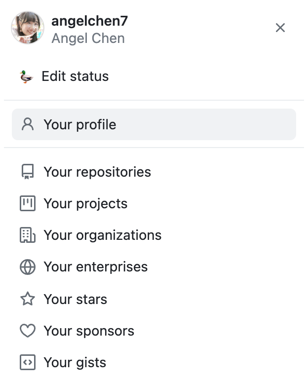
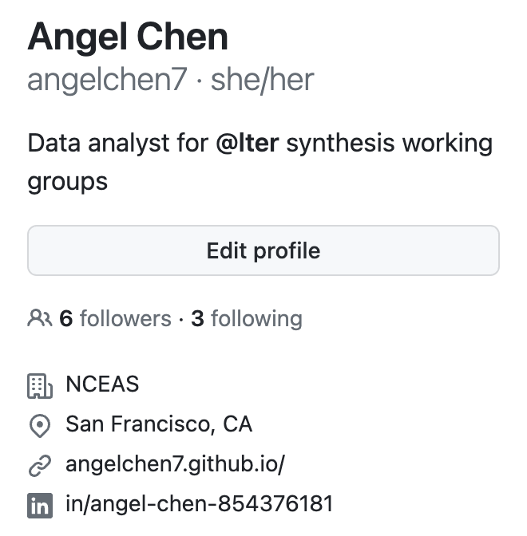
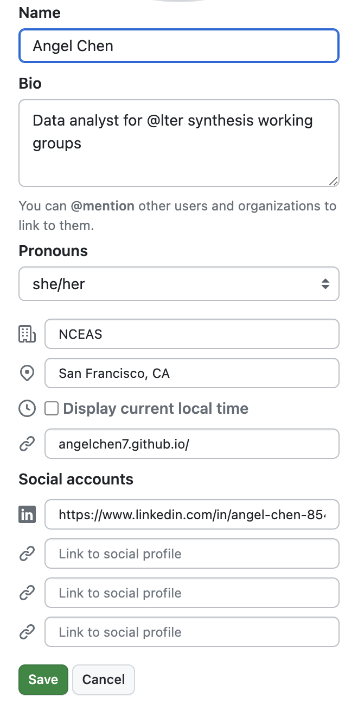
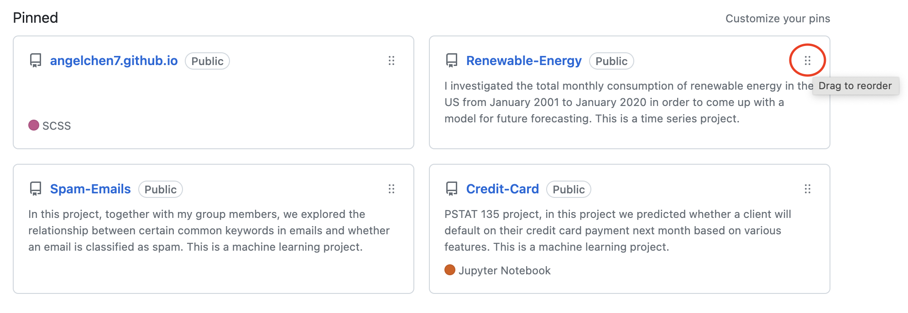
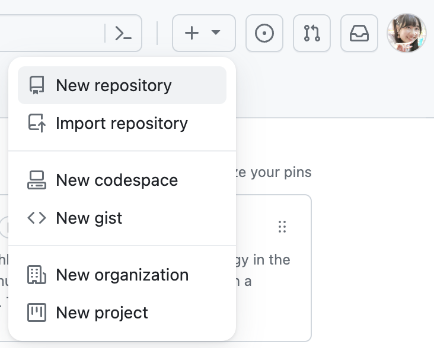
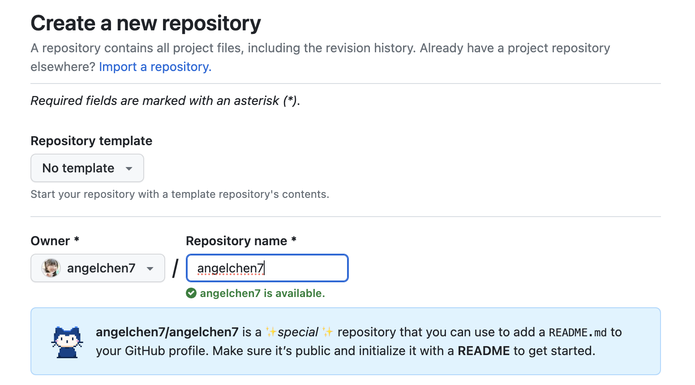
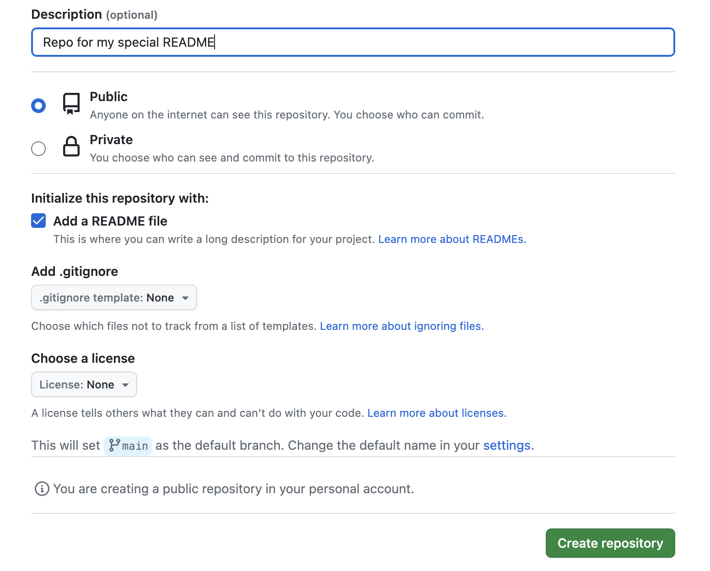
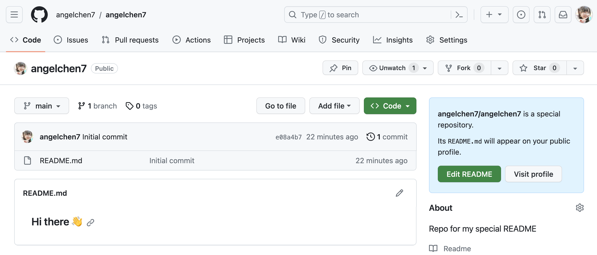
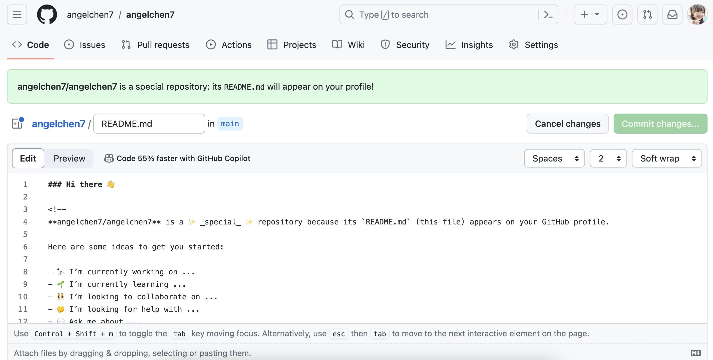

:::{.callout-tip icon="false" collapse="false"}
###  Learning Objectives

By the end of this module, you will be able to:

- <u>Explain</u> the benefits of using GitHub as a portfolio
- <u>Identify</u> ways to strengthen your profile's presence on GitHub 
- <u>Create</u> a "special README" on your profile
- <u>Add</u> informative READMEs to your repositories

:::

## Why Use GitHub as a Portfolio?

GitHub is useful for tracking changes and hosting code which makes it a great place to showcase those same products! **A fully fleshed-out GitHub profile will clearly capture who you are as a programmer/scientist, what you do, and allow people to get a neat overview of your work.** A strong GitHub presence can help you stand out from a pool of many applicants for graduate school programs or other jobs; particularly when a proven track record of tech-savvy and knowledge of collaborative tools are listed as requirements. Having a detailed portfolio is a nice way to personally keep track of all the work and achievements you've accomplished as well! You can utilize GitHub's existing functionalities to curate your own portfolio. 

## Strengthen Your GitHub Presence

### Customize Your Profile

Filling out your profile details is an easy way to get started on your portfolio! To edit your profile, click on your icon in the top right corner and go to "Your profile". 

{fig-alt="Screenshot of the sidebar of GitHub where a user can navigate among different facets of their GitHub presence" fig-align="center" width="30%"}

Then select "Edit profile" on the right hand panel. 

{fig-alt="Screenshot of the user information on the left side of the Github profile window" fig-align="center" width="30%"}

There, you will have options to edit your icon, name, biography, pronouns, workplace, location, website, and social media accounts. If you have links to other websites that contain your work, it's a good idea to cross-reference them here so people can find you elsewhere.

{fig-alt="Screenshot of the user information on a GitHub profile where the 'edit' button has been clicked and all fields are edit-able" fig-align="center" width="30%"}

Alternatively, you can also edit your profile by clicking on your icon in the top right corner to go to "Settings", then "Public profile". 

### Pin Repositories

Additionally, you can choose to pin up to 6 public repositories to show off to anyone who visits your profile. These pinned repos will be at the top of your profile page, greatly increasing their visibility to visitors. 

To choose which repositories to pin, navigate to the "Your profile" tab again and click "Customize your pins". Once you've pinned the repositories you particularly want to highlight you can reorder your pinned repos by dragging the 6 dots at the top right corner.

{fig-alt="Screenshot of the pinned repositories for a user where the grid of six squares in the top right of one of the pinned repositories is circled in red"}

When you're picking out your top repositories we recommend including repositories that:

- You're excited about (passion is always worth highlighting!)
- Showcase a breadth of skills
- Demonstrate significant expertise in a narrow range of skills
- You're proud of / were significant to your career
- You could paraphrase in an interview context

## Special README

A fun semi-secret feature of GitHub is that you can have a "special README" displayed at the top of your profile! This is an easy way to present your work and interests to the rest of the GitHub community and anyone who visits your profile.

To get started, from your profile landing page, click on the dropdown menu with a  icon in the top right corner of your profile (just to the left of the profile circle) and select "New repository".

{fig-alt="Screenshot of the dialogue menu for creating a new repository from the GitHub user's profile" fig-align="center" width="50%"}

Name your new repo the same name as your username. A notification should pop up indicating that you're creating a special repo.

{fig-alt="Screenshot of the new repository menu in GitHub where GitHub is adding a dialogue indicating the repository is 'special' because its name matches the user's name" fig-align="center" width="80%"}

Feel free to write an optional description. Set the repo visibility to public and make sure to check the box to initialize the repo with a README file. Click on the "Create repository" button once you're done!

{fig-alt="Screenshot of making the special repository where the 'add a README' box is checked but no other fields are changed from their defaults" fig-align="center" width="80%"}

This is what the special repo will look like. Notice the notification on the right hand side informing you that the README.md file will appear on your profile. Click on the "Edit README" button to get started. Note that you _could_ clone the special repo and edit from whatever code/text editor you prefer but given that the only editing you'll do is to a markdown file that seems excessive to us.

{fig-alt="Screenshot of a user's special repository after it has been created and the README contains only default content"}

GitHub will have already populated README.md with a template that you can use as a starting point. Edit this Markdown file to your own liking. Here is a [handy guide](https://docs.github.com/en/get-started/writing-on-github/getting-started-with-writing-and-formatting-on-github) on formatting your text if you are not familiar with Markdown syntax. 

Some nice sections to include in your README.md are an "About me" section that gives a background on your work and interests, a contributions/achievements section, and a section on any other communities you're involved in. 

{fig-alt="Screenshot of a special repository's README where invisible elements are revealed by editing the file"}

You can add [emojis](https://docs.github.com/en/get-started/writing-on-github/getting-started-with-writing-and-formatting-on-github/basic-writing-and-formatting-syntax#using-emoji), [images and GIFs](https://docs.github.com/en/get-started/writing-on-github/getting-started-with-writing-and-formatting-on-github/basic-writing-and-formatting-syntax#images) so have fun editing your special README. 

## Informative READMEs

On a related note, an informative README **in each repository** is crucial to orienting your audience to the files in and purpose of each repository. It's good practice to add an informative README to every repository so visitors know its purpose and what it contains. A well-written README will be useful to both coders and non-coders alike. 

This workshop contains a module that is focused on this topic! Look for "Informative READMEs" in the sidebar on the left.

## How to Stand Out

If you act on the suggestions we've outlined above you will already be well on the way to fully leveraging GitHub as a professional portfolio. That said, there are always means of making yourself and your work stand out even more! Below is a non-exhaustive list of some ideas for continuing to improve your portfolio.

### Create a Personal Website

Personal websites are a cool way to visually convey everything that goes into a portfolio--your background, work experiences, interests, accomplishments, projects, contact information, etc. With a website, you can be more creative and flexible in how you want to present yourself to others. Plus, non-GitHub users may be more inclined to navigate someone's personal website rather than their GitHub profile. A further benefit of creating a personal website is that you will learn (and demonstrate!) a suite of additional skills that contribute to your portfolio in and of themselves.

Although the topic of creating your own personal website is outside the scope of this workshop, there are tons of resources on how to get started. If you're interested, **check out the SciComp team's workshop on [building a website with Quarto](https://lter.github.io/workshop-quarto/).** Also feel free to check out [Sam Csik](https://samanthacsik.github.io/)'s tutorials on how to [create](https://ucsb-meds.github.io/creating-quarto-websites/) and [customize](https://ucsb-meds.github.io/customizing-quarto-websites/#/title-slide) your website using [Quarto](https://quarto.org/). 

Since this will be a personal website deployed through [GitHub Pages](https://pages.github.com/), remember to name your Quarto project and GitHub repo: `<YOUR-GITHUB-USERNAME>.github.io`, replacing `<YOUR-GITHUB-USERNAME>` with your actual username. You're only allowed one user website with the github.io suffix. Follow the instructions in the linked tutorials to deploy the website via GitHub when you're done! If all goes well, your website will be live at: https://\<YOUR-GITHUB-USERNAME\>.github.io/

If you're looking for some inspiration, check out the personal websites of some members of the LTER SciComp team: 

- Angel Chen - [angelchen7.github.io](https://angelchen7.github.io/)
- Nick Lyon - [njlyon0.github.io](https://njlyon0.github.io/)

### Team Up with Peers

Within any career path some of the best people to get professional feedback from are your peers! Your colleagues have applied to the same types of positions that you have and often have crucial insight that can help you learn from both the successes and the pitfalls that they have encountered. In addition, they can a well-trained critical eye that can help you improve your portfolio in ways you may never have imagined by yourself.

Once you have a draft portfolio, share it with your peers, advisers, and mentors for feedback. Write down their suggestions and act on all of the ones that seem reasonable to you. If you'd like, repeat this process of iterative revision for as long as you feel that it is needed! It may also make sense to gather other peers without GitHub portfolios into a journal club-style group and meet regularly to develop and critique one another's materials.
