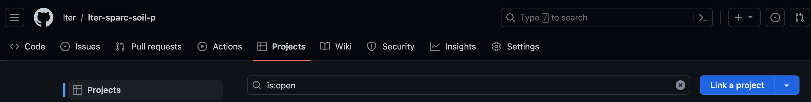
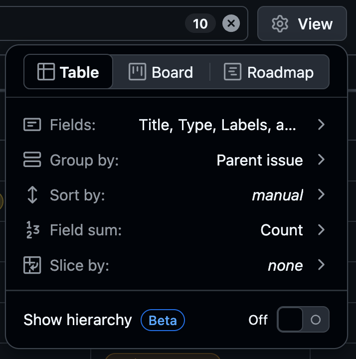
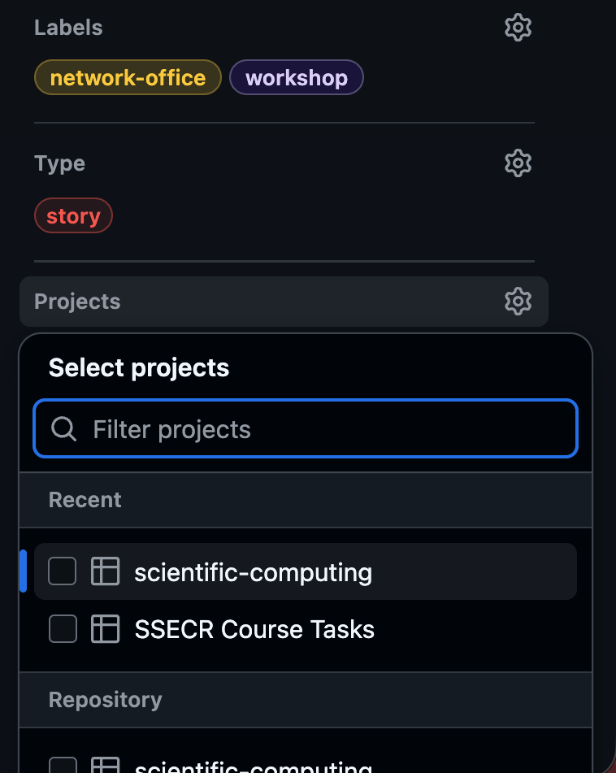
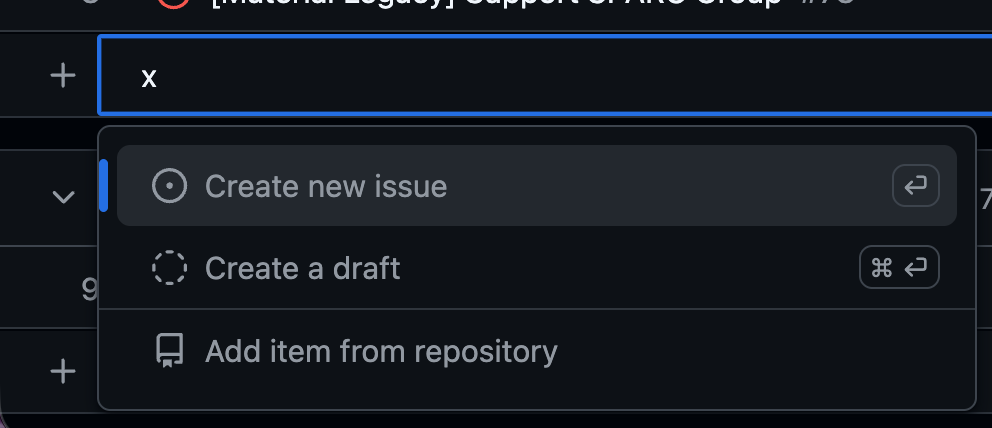

:::{.callout-tip icon="false" collapse="false"}
###  Learning Objectives

By the end of this module, you will be able to:

- <u>Define</u> a project in the context of GitHub
- <u>Explain</u> in what contexts Projects are useful
- <u>Identify</u> the three available project view options
- <u>Explain</u> how issues can get added to projects

:::

## What is a Project?

Projects are GitHub's primary _strategic_ project management tool. While issues can be very useful for particular tasks at a tactical, on-the-ground level, they are less valuable for making larger-scale plans and tracking evolving priorities. **A project acts as an umbrella that includes many issues** and tracks their inter-relationships and where they fit in a bigger-picture view of a project.

## Using Projects

Projects can be super useful, but they also include a non-trivial amount of setup and maintenance. So, **you should use a GitHub Project _only_ if <u>most</u> of the following applies to you:**

1. You use issues _extensively_
2. You use many metadata features within issues
    - E.g., assignees, labels, issue relationships
2. You have at least three repositories, all with their own issues
3. Project management is exciting to you

At the LTER SciComp team we use Projects extensively, but that's because all three of those statements apply to us! For many working groups, **using issues and issue metadata can be enough for the scale of their project.** However, if you do decide you want to use Projects, check out the information contained in this module!

## Project Ownership

**Projects can only be owned by a particular user or an organization.** In either case, any number of users can be allowed access to the project. The list of all projects owned by an organization/user can be accessed via the "projects" tab. Note that this tab's name is consistent for users and organizations; organizations just have more tabs to support the expanded set of tools available to them. Note that in the screenshot below we are in an organization ("lter") _not_ a specific repository.

{fig-alt="Screenshot of the 'projects' tab of a GitHub organization"}

Once a project has been created, **it can be "linked" to any number of repositories owned by the same entity.** This can be done from the "Projects" tab of each repository to which linking is desired. Note in the top left of the screenshot below that we are in a repository owned by the LTER GitHub organization.

{fig-alt="Screenshot of the 'projects' tab of a particular repository"}

## Using Projects

Within the team that created this workshop, we use issues to track and document the work that we do on behalf of working groups. Because there are so many issues spread across so many repositories, we are an ideal candidate to maximize the value of GitHub projects. See below for a screenshot of what our project looks like (as of early spring 2026).

{fig-alt="Screenshot of an open project in 'table' view with many open issues with a number of visible metadata fields as columns"}

Note that the issue above has the view set to nest issues beneath their parent issue because our team also extensively uses the issue "relationship" feature. See the issues module for more detail on that feature.

### Customizing Project Interface

You can change which metadata fields are visible, how issues are grouped or sorted, and even the project view itself by clicking the " View" button (top right corner) and customizing the options within the resulting dropdown menu. 

{fig-alt="Screenshot of the 'View' settings menu in a GitHub project" fig-align="center" width="50%"}

If you want, you can also add and customize multiple separate views in the same project! This is a great choice if your group includes a variety of thinking or learning styles and the separate tabs will all have the same issues included.

{fig-alt="screenshot of the tabs at the top of a GitHub project" fig-align="center" width="60%"}

## Integrating Issues

After you make a project, you'll want to add issues to it! **You can either add issues to a project from the issue itself or from the project directly.** See the tabs below for instructions of either approach.

:::{.panel-tabset}
### From Issue

Adding an issue to a project can be done **from the issue's metadata options.** You can do this when you first create an issue or after the fact. In the screen captures below, we'll show how to do this with an existing issue.

To start, **go to the issue you want to add**. Once you're there, look at the metadata sidebar and **find the "Projects" section** (should be just above "Milestone" and just below "Type"). Next, **click the  gear icon** in the top right corner of that option.

This should give you a list of the projects that: (1) you have recently opened, or (2) are linked to the repository in which the issue lives. **Check the box next to the project to which you want to add this issue.**

{fig-alt="Screenshot of the metadata sidebar of a GitHub issue with the 'Projects' option open" fig-align="center" width="40%"}

Once you've chosen your project, the metadata sidebar should update to show which project the issue is now linked to. However, it adds a new sub-field called "Status" that likely says "No status". **"Status" is a project option that you can use to track the lifecycle of an issue.** The default options are "To Do", "In Progress", and "Done" but you can add custom ones if you want!

{fig-alt="Screenshot of the metadata sidebar of a GitHub issue where a project has been selected but the status says 'no status'" fig-align="center" width="40%"}

**Click "No status" to see a dropdown menu** of statuses available in your project **and pick one from the list.** In this case, we'll pick "Active Progress" as we are currently working on this issue.

{fig-alt="Screenshot of the metadata sidebar of a GitHub issue with the dropdown menu of available project status options expanded" fig-align="center" width="40%"}

Once you've done this, the chosen status should be visible in the metadata of the issue. If you change the status (either from the issue or from the project), it'll update here. The history of statuses of this issue will also appear in the chronological comments on the left sidebar of the issue.

{fig-alt="Screenshot of the metadata sidebar of a GitHub issue where a project has been selected and the status is 'Active Progress'" fig-align="center" width="40%"}

### From Project

Adding an issue to a project can be done **from the project itself** as well. This is a little more straightforward than adding from the issue as some pieces of data (e.g., project status) are specified implicitly depending on where in the project you add the new issue.

At the bottom of most project views, there should be a small  plus sign button. Click it and you'll be able to either (A) add a new issue that is attached to this project, (B) create a "draft", or (C) add an existing issue from a repository to which this project is linked. 

If you start typing the title of an issue, this dropdown menu should automatically update itself with issues in repositories linked to this project that have a partial match to what you are typing.

{fig-alt="Screenshot of the 'add item' menu in a GitHub project with some options on adding or making a new issue" fig-align="center" width="75%"}

A "draft" in this context is sort of a partial issue that is specific to projects and can't be created elsewhere. For the sake of clarity, we recommend either making a new issue or adding an existing one rather than using this somewhat ambiguous option.

:::
